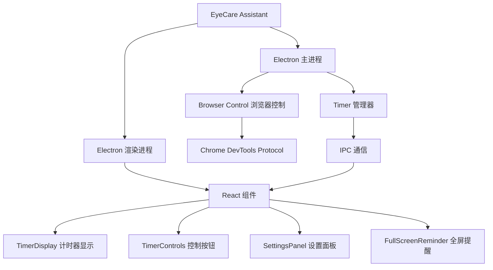

# 护眼小助手 (Eye Protection Assistant)

<div align="center">


<p>一款专业的护眼定时提醒软件，帮助用户保护视力健康，预防眼疲劳</p>
<p>A professional eye-care timer application that helps users protect their vision and prevent eye fatigue</p>

<p align="center">
  
</p>

</div>

## 功能亮点 (Features)

### 专业护眼计时功能 (Professional Eye-care Timer)

- 🕑 **定制化工作/休息周期**：基于番茄钟工作法，支持自定义工作时间和休息时间
- 🔊 **沉浸式休息提醒**：全屏休息提醒页面，带有动态光效和护眼小贴士
- 🌈 **多种主题选择**：提供蓝色、暗黑、暖色、自然四种主题风格
- 💻 **智能浏览器防干扰**：自动检测浏览器视频播放状态，避免打断重要观看内容

### 技术实现亭点 (Technical Highlights)

- 🛠 **Electron 多窗口管理**：提供主窗口与全屏提醒窗口切换
- 💭 **IPC 高效通信**：使用 Electron 的 IPC 机制达成主进程与渲染进程的高效通信
- 🔍 **Chrome DevTools Protocol 集成**：通过 CDP 检测浏览器视频播放状态
- ♻️ **基于 React + TypeScript 的响应式 UI**：构建流畅更新的交互界面
- 💬 **有单元测试保障**：使用 Jest 进行关键功能测试，确保代码质量

### 界面展示 (Interface Showcases)

<div align="center">
  <table>
    <tr>
      <td>
        <br/>
        <p align="center">主计时器界面 (Main Timer)</p>
      </td>
      <td>
        <br/>
        <p align="center">设置面板 (Settings Panel)</p>
      </td>
      <td>
        <br/>
        <p align="center">休息提醒界面 (Rest Reminder)</p>
      </td>
    </tr>
  </table>
</div>

## 开发技术栈 (Technology Stack)



### 前端技术 (Frontend)

- **React 18**: 构建响应式用户界面
- **TypeScript 5**: 提供类型检查，增强代码可维护性
- **CSS Variables & Modules**: 实现可切换主题和组件样式集中管理

### 后端技术 (Backend)

- **Electron 28.0**: 跨平台桌面应用开发
- **Node.js**: 提供系统级别的功能
- **Chrome DevTools Protocol**: 与浏览器集成交互

### 工具链 (Toolchain)

- **Vite**: 现代化的前端构建工具
- **Electron Builder**: 应用打包工具
- **Jest**: 单元测试框架

## 核心模块 (Core Modules)

### 计时器模块 (Timer Module)

```typescript
// 计时器状态管理
export enum TimerState {
  IDLE = 0,     // 空闲
  WORKING = 1,  // 工作中
  RESTING = 2,  // 休息中
  PAUSED = 3,   // 暂停
}

// 计时器类
export class Timer {
  // ...核心计时逻辑
  startTimer(workTime: number, restTime: number): void { /* ... */ }
  pauseTimer(): void { /* ... */ }
  resumeTimer(): void { /* ... */ }
  resetTimer(): void { /* ... */ }
  finishRest(): void { /* ... */ }
}
```

### 浏览器控制模块 (Browser Control Module)

```typescript
// 负责与浏览器集成
export class BrowserControl {
  // 连接到Chrome浏览器
  async connect(): Promise<boolean> { /* ... */ }
  
  // 监测视频状态
  startVideoMonitoring(callback: (isPlaying: boolean) => void): void { /* ... */ }
  
  // 断开连接
  async disconnect(): Promise<void> { /* ... */ }
}
```

### IPC 通信模块 (IPC Communication)

```typescript
// 在preload.ts中暂露API
contextBridge.exposeInMainWorld('electronAPI', {
  // 计时器控制
  startTimer: (workTime: number, restTime: number) => {
    return ipcRenderer.invoke('start-timer', workTime, restTime);
  },
  pauseTimer: () => ipcRenderer.invoke('pause-timer'),
  resetTimer: () => ipcRenderer.invoke('reset-timer'),
  
  // 监听事件
  onTimerUpdate: (callback) => {
    ipcRenderer.on('timer-update', (_event, data) => callback(data));
    return () => ipcRenderer.removeListener('timer-update', callback);
  }
});
```

## 实现的技术难点 (Technical Challenges Solved)

### 1. 多窗口协调管理 (Multi-Window Management)

通过主窗口与全屏休息窗口的切换与通信，实现了无缝的休息提醒体验。全屏休息窗口能够准确的接收剩余时间并展示倒计时。

### 2. 浏览器集成接口 (Browser Integration)

使用Chrome DevTools Protocol (CDP)实现了对浏览器的视频播放状态检测，避免了在用户观看重要视频时被休息提醒打断。

### 3. 性能优化 (Performance Optimization)

采用了多种性能优化策略，包括使用React.memo避免不必要的重渲染，将计时逻辑放在主进程以减少渲染进程的计算负担。

## 使用方法 (Usage)

### 安装依赖 (Install Dependencies)

```bash
npm install
```

### 开发模式 (Development Mode)

```bash
npm run dev
```

### 构建应用 (Build)

```bash
npm run build
```

### 打包应用 (Package)

```bash
npm run package
```

### 运行测试 (Run Tests)

```bash
npm test
```

## 项目结构 (Project Structure)

```
护眼小助手/
├── src/                   # 源代码文件夹
│   ├── index.ts          # 程序入口
│   ├── main/             # Electron 主进程
│   │   ├── main.ts        # 主进程入口
│   │   ├── timer.ts       # 计时器逻辑
│   │   └── browser-control.ts # 浏览器控制
│   ├── preload/          # 预加载脚本
│   │   └── preload.ts     # 渲染进程预加载
│   └── renderer/         # 渲染进程
│       ├── components/    # React 组件
│       │   ├── Timer/       # 计时器相关组件
│       │   ├── Settings/    # 设置相关组件
│       │   └── Reminder/    # 提醒组件
│       ├── styles/        # CSS 样式
│       ├── App.tsx         # 主应用组件
│       ├── main.tsx        # 主窗口入口
│       ├── reminder.tsx    # 提醒窗口入口
│       ├── index.html      # 主窗口HTML
│       └── reminder.html   # 提醒窗口HTML
├── tests/                # 单元测试
├── assets/               # 静态资源
├── dist/                 # 构建输出目录
├── package.json          # 项目配置
├── tsconfig.json         # TypeScript配置
├── vite.config.ts        # Vite构建配置
├── jest.config.js        # Jest测试配置
├── .gitignore            # Git忽略文件
└── README.md             # 项目说明
```

## 贡献指南 (Contributing)

欢迎对项目进行改进和功能扩展！请参考以下步骤：

1. Fork 本仓库
2. 创建你的特性分支 (`git checkout -b feature/amazing-feature`)
3. 提交你的更改 (`git commit -m 'Add some amazing feature'`)
4. 推送到分支 (`git push origin feature/amazing-feature`)
5. 创建 Pull Request

## 授权许可 (License)

本项目采用 ISC 许可证进行许可。

## 免责声明 (Disclaimer)

该应用并非医疗设备，仅作为辅助工具来提醒用户休息。如果您有任何眼部疲劳或者视力问题，请咨询专业医学人员。